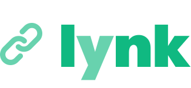

<div align="center">

[](https://github.com/chroline/lynk)

[](https://github.com/chroline/lynk/releases)

[](https://codeclimate.com/github/chroline/lynk/maintainability)
[](https://github.com/chroline/lynk/blob/main/LICENSE)

**open-source "link in bio" clone**

</div>

<br />

# 🚀 Introduction

**lynk** is an open-source, self-hosted link-in-bio clone! With lynk, developers can easily set up their own custom
link-in-bio page, allowing them to showcase their projects and promote their work in a single, easy to find location.
lynk is fully customizable, allowing developers to tailor the look and feel of their page to their individual needs and
preferences.

**lynk** is powered by:

- **MDX**, for adding interactive content
- **Next.js**, to enable SSG for lightning-fast load times
  - [**`next-seo`**](https://github.com/garmeeh/next-seo), to enrich your site with SEO
- **SCSS**, for customizing the look of your site
- **Typescript**, because it's 2023

Thanks for checking out the project, and happy coding!

# 🌟 Quickstart

### _Easy as 1, 2, 3!_

1. Fork the [`chroline/lynk`](https://github.com/chroline/lynk) template repo. This will give you a blank canvas for
   your HandyDocs instance. (Or, use [`degit`](https://github.com/Rich-Harris/degit) to scaffold your project by running
   `degit chroline/lynk`)
2. Clone your forked repo to your local machine.

   ```bash
   git clone *YOUR_REPO*
   ```

3. Customize your instance and add content.

**...and then you're done!**

Since **lynk** is built with JAMStack technologies, you can deploy your instance to your favorite serverless/static web
host provider like [Vercel](https://vercel.com/solutions/nextjs) or [Netlify](https://www.netlify.com/with/nextjs/).

# 📖 Documentation

In-depth documentation is coming soon! For now, check out the example in the template repo.

# 🧑‍💻 Contributing

Interested in contributing to the HandyDocs project? Thanks so much for your interest! We are always looking for
improvements to the project and contributions from open-source developers are greatly appreciated.

# 📄 License

**lynk** is free and open-source software licensed under the MIT License.
[View the full license](https://github.com/chroline/lynk/blob/main/LICENSE)
